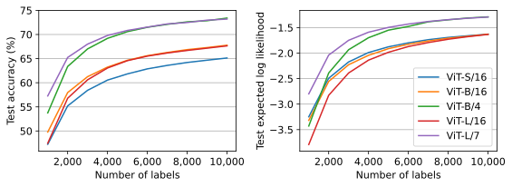

# MSN embeddings of ImageNet images

This repo contains code adapted from [`msn`](https://github.com/facebookresearch/msn) for use in [`epig`](https://github.com/fbickfordsmith/epig)'s pipeline for semi-supervised Bayesian active learning.
It might also be useful elsewhere.


## Results

<div align="center">
	
</div>

Predictive performance of a linear classifier trained on an increasing number of labelled embeddings (class-balanced random samples).


## Getting set up

Clone the repo and move into it:

```bash
git clone https://github.com/fbickfordsmith/msn-embeddings.git && cd msn-embeddings
```

If you're not using a CUDA device, remove the `cudatoolkit` and `pytorch-cuda` dependencies in `environment.yaml`.

Create an environment using [Mamba](https://mamba.readthedocs.io) (or [Conda](https://conda.io), replacing `mamba` with `conda` below) and activate it:

```bash
mamba env create --file environment.yaml && mamba activate msn-embeddings
```


## Reproducing the results

Compute embeddings:

```bash
# Set data_dir and data_subdir so that data_dir/data_subdir/ contains train/ and val/
# directories, where those directories in turn contain n01440764/, n01986214/, etc.
data_dir=datasets
data_subdir=imagenet
embeddings_dir=data
models_dir=models

mkdir -p ${embeddings_dir} ${models_dir}

# Use names from https://github.com/facebookresearch/msn/blob/main/src/deit.py.
architectures=(deit_small deit_base deit_base_p4 deit_large deit_large_p7)

# Use names from https://github.com/facebookresearch/msn/blob/main/README.md.
checkpoints=(vits16_800ep vitb16_600ep vitb4_300ep vitl16_600ep vitl7_200ep)

for i in {0..4}; do
    architecture=${architectures[${i}]}
    checkpoint=${checkpoints[${i}]}

    curl --output ${models_dir}/${checkpoint}.pth.tar https://dl.fbaipublicfiles.com/msn/${checkpoint}.pth.tar

    echo "Computing embeddings - ${checkpoint}"

    python compute_embeddings.py \
        --fname ${checkpoint}.pth.tar \
        --model-name ${architecture} \
        --pretrained ${models_dir} \
        --root-path ${data_dir} \
        --image-folder ${data_subdir} \
        --embeddings-path ${embeddings_dir}
done
```

Evaluate the embeddings in downstream classification:

```bash
for encoder in vits16_800ep vitb16_600ep vitb4_300ep vitl16_600ep vitl7_200ep; do
    echo "Evaluating embeddings - ${encoder}"
    for seed in {0..19}; do
        python evaluate_embeddings.py --encoder ${encoder} --seed ${seed}
    done
done
```

Plot the results:

```bash
python plot_results.py
```


## Citing this work

[`msn`](https://github.com/facebookresearch/msn) repo and MSN training method:

```bibtex
@article{assran2022masked,
    author = {Assran, Mahmoud and Caron, Mathilde and Misra, Ishan and Bojanowski, Piotr and Bordes, Florian and Vincent, Pascal and Joulin, Armand and Rabbat, Michael and Ballas, Nicolas},
    year = {2022},
    title = {Masked {Siamese} networks for label-efficient learning}, 
    journal = {European Conference on Computer Vision},
}
```

This repo:

```bibtex
@article{bickfordsmith2024making,
    author = {{Bickford Smith}, Freddie and Foster, Adam and Rainforth, Tom},
    year = {2024},
    title = {Making better use of unlabelled data in {Bayesian} active learning},
    journal = {International Conference on Artificial Intelligence and Statistics},
}
```

([`src/`](/src/) in this repo is a lightly modified version of [`src/`](https://github.com/facebookresearch/msn/tree/main/src) in the original repo, and [`compute_embeddings.py`](/compute_embeddings.py) in this repo is a modified version of [`logistic_eval.py`](https://github.com/facebookresearch/msn/blob/main/logistic_eval.py) in the original repo.
The remainder of this repo is new.)
